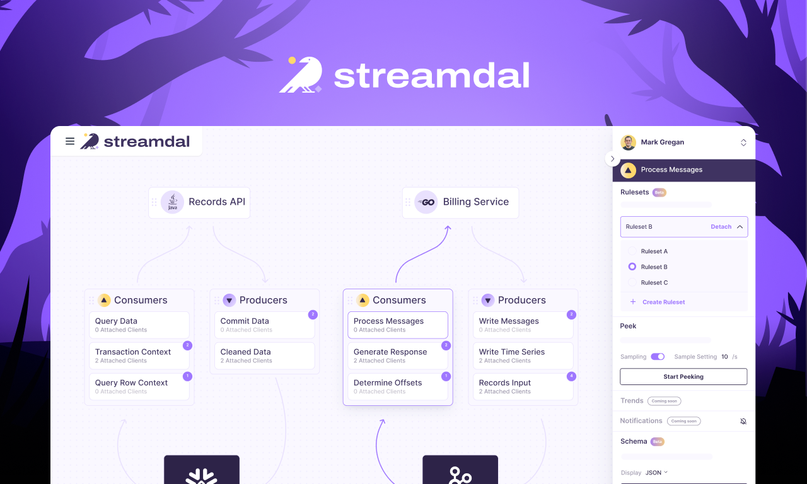

<div align="center">
   
  

[](https://github.com/streamdal/streamdal)
[](https://discord.gg/streamdal)

</div>  

Streamdal is an open-source _**'Code-Native Data Privacy'**_ solution for 
running data tasks _directly_ in your application code.

<sub>Think of it as a "workflow engine" or a "pre/post data processor" that
is executed client-side via WebAssembly in your application code.</sub>

It is at least _10x faster_, _10x cheaper_ and _10x easier_ to operate than
traditional data pipelines.

----

<sub>_This is what it looks like:_</sub>


<div align="center">

[Manifesto](#manifesto) •
[Benefits](#benefits) •
[Demo](#live-demo) •
[Getting Started](#getting-started) •
[How Does It Work?](#how-does-it-work) •
[Community](#community) •
[Resources](#resources)

</div>

# Benefits

There are major benefits to running pipelines directly within your app:

* **Eliminates** the need for a separate data pipeline infrastructure
   * Pipelines execute from within your app, using existing compute that your
     app is already using
* **Eliminates** the need for a separate data pipeline team
   * No more waiting for the data pipeline team to make pipeline changes
* Is **ridiculously** fast
   * Streamdal uses Wasm to execute pipelines at near-native speeds
* Is **actually** real-time
   * Not "near real-time" or "max-30-seconds-real-time" - but _actually_
     real-time - data is processed as soon as your app reads or writes data
* [And **many** other reasons](https://docs.streamdal.com/en/getting-started/use-cases/)

# Live Demo

You don't have to install the [server](https://github.com/streamdal/streamdal/tree/main/apps/server), the [console](https://github.com/streamdal/streamdal/tree/main/apps/console) or [instrument](https://docs.streamdal.com/en/guides/instrumentation/)
any of your apps to see Streamdal in action. We've got a live demo :)

### [DEMO.STREAMDAL.COM](https://demo.streamdal.com)

While the demo is read-only, it will give you a good idea about the capabilities
of Streamdal.

The demo showcases **real-time**:

1. PII detection & masking
1. Schema inference/detection & validation
1. Data extraction & truncation
1. Stream debugging & monitoring
1. Data source and destination visualization & exploration

<sub>_You can read more about how this is achieved in the ["how does it work?"](https://docs.streamdal.com/en/getting-started/how-streamdal-works/) docs._</sub>

# Getting Started

Getting started consists of two steps:

1. **Installing** the server, console and their dependencies
2. **Instrumenting** your code with one of our [SDKs](https://docs.streamdal.com/en/core-components/sdk/)

### Install

The _easiest_ way to get Streamdal running is via `curl | bash`:

```
curl -sSL https://sh.streamdal.com | bash
```

1. The install script will verify that you have `git`, `docker` and `docker-compose` installed
2. The install script will clone this repo to `~/streamdal`
3. The install script will bring up all components via `docker-compose`

Once done:

🎉 **Open`http://localhost:8080` in your browser!** 🎉

You should be presented with a _beautiful_ (but empty) UI! To populate it,
we will need to instrument some code. _Onto the next section!_

<sub>_For alternative installation methods, check the [docs](./docs) dir._</sub>

### Instrument

Once you have installed the server and console, you can begin instrumenting your
code.

_Instrumentation_ involves calling our SDKs `.Process()` method either **after**
your application reads data from somewhere _OR_ **before** your app is about to
write data somewhere.

#### SDKs

- [Go](https://github.com/streamdal/streamdal/tree/main/sdks/go) ━ [Example](https://github.com/streamdal/streamdal/tree/main/sdks/go#example-usage)
- [Python](https://github.com/streamdal/streamdal/tree/main/sdks/python) ━ [Example](https://github.com/streamdal/streamdal/tree/main/sdks/python#example-usage)
- [Node](https://github.com/streamdal/streamdal/tree/main/sdks/node) ━ [Example](https://github.com/streamdal/streamdal/tree/main/sdks/node#getting-started)

> To see an example of a _complete_ instrumentation, take a look at one of our
> [shim examples](https://docs.streamdal.com/en/core-components/libraries-shims/) 
> or the [Go demo client](./apps/server/test-utils/demo-client/) that is bundled
> with the [./apps/server](./apps/server/test-utils/demo-client/).

# How Does It Work?

Streamdal consists of **three** main components:

- **[Server](https://github.com/streamdal/streamdal/tree/main/apps/server)**
- **[Console](https://github.com/streamdal/streamdal/tree/main/apps/console)**
- **[SDKs](https://docs.streamdal.com/en/core-components/sdk/)**

The basic flow is that you [install](#getting-started) the server and console and wrap any 
reads or writes in your app with one of our SDKs. Once that's done, you will be 
able to see the app and the data your app is reading or writing in the 
[console](https://github.com/streamdal/console) (or use the [CLI](https://github.com/streamdal/cli)).

You will also be able to enforce rules on your data (such as _"this should be 
valid JSON"_, _"message should contain a field called `foo`"_, _"strip all email
addresses"_ and so on).

> [!IMPORTANT]
> For a more in-depth explanation of the flow and the various components, visit 
> our [docs](https://docs.streamdal.com/en/getting-started/how-streamdal-works/).

# Repo Layout

This repo is a [monorepo](https://en.wikipedia.org/wiki/Monorepo) that has the following layout and usage:

```plaintext
# ┌── assets                 <--- Static assets 
# │   ├── img
# │   └── ...
# ├── apps
# │   ├── cli                <--- CLI UI 
# │   ├── console            <--- Web-based UI
# │   ├── docs               <--- https://docs.streamdal.com 
# │   ├── server             <--- Server component
# │   └── ...
# ├── docs
# │   ├── install
# │	│    ├── bare-metal
# │	│    ├── docker
# │	│    └── ...
# |   ├── instrument
# |   └── ...
# ├── libs
# │   ├── protos             <--- Common protobuf schemas
# │   ├── wasm               <--- Wasm funcs used in pipeline steps
# │   ├── wasm-detective     <--- Wasm lib used for data parsing and validation 
# │   ├── wasm-transformer   <--- Wasm lib used for data transformation
# │   └── ...
# ├── scripts                   
# │   ├── install
# │   │	  └── install.sh     <--- Install script for installing Streamdal
# │   └── ...
# ├── LICENSE
# ├── Makefile               <--- Makefile with common tasks; run `make help` for more info
# └── README.md
```

### Tested Versions

The Streamdal platform is made up of several components that must all be at specific versions to function properly together.

When running in production, verify versions of the components against this list:

| Date       | Server | Console | Protos | Wasm   | Helm   |
|------------|--------|---------|--------|--------|--------|
| 05.08.2024 | 0.0.38 | 0.0.69  | 0.1.56 | 0.1.38 | 0.1.61 |

# Community

We're building Streamdal in the open and we'd love for you to join us!

Join our [Discord](https://discord.gg/streamdal)!

### Getting Help

Stuck? Something not working right? Have questions?

* First and _easiest_ way to get help is to join our [Discord](https://discord.gg/streamdal)
* If you're not in the mood to chat - there's [docs](https://docs.streamdal.com)
* If all else fails, [open an issue](https://github.com/streamdal/streamdal/issues/new)!

### Roadmap

You have control over what we're building - [our roadmap is 100% public](https://github.com/orgs/streamdal/projects/1)!

Feel free to stop by to discuss features, suggest new ones or just keep an eye
on what's in the pipeline.

### Contributing

We :heart: contributions! But... before you craft a beautiful PR, please read
through our [contributing docs](https://docs.streamdal.com/en/resources-support/contributing/).

### License

This project is licensed under the `Apache-2.0` license. 

See the [LICENSE](LICENSE) file for more info.
