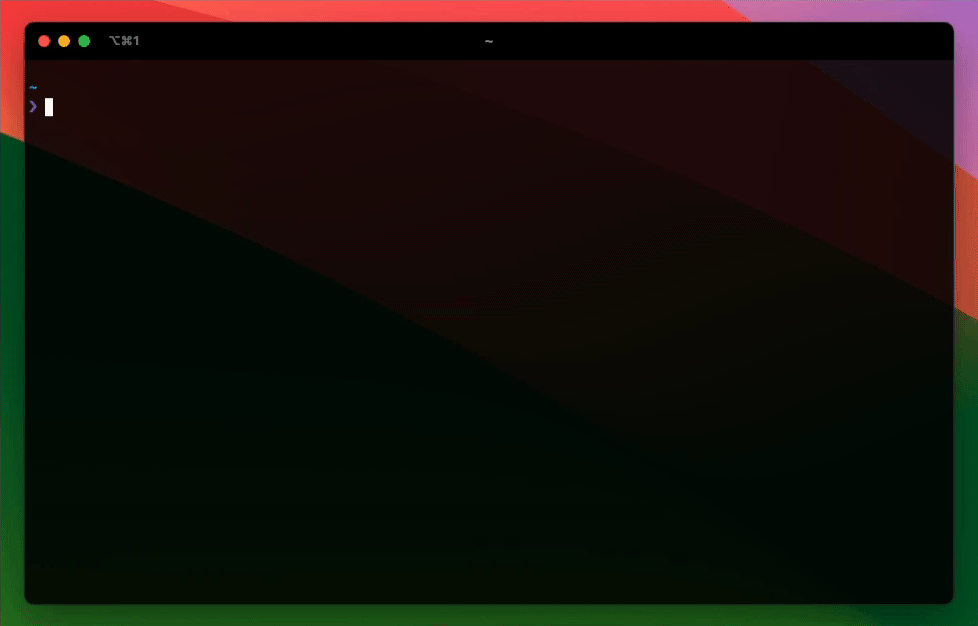

CLI
===
[](https://github.com/streamdal/streamdal/actions/workflows/apps-cli-release.yml)
[](https://github.com/streamdal/streamdal/actions/workflows/apps-cli-pr.yml)
[](https://discord.gg/streamdal)

_**CLI tool for [Streamdal](https://streamdal.com).**_

> It's like a `tail -f` for watching the I/O in your app!

NOTE: This app looks best if you use it in a _modern_ terminal that has TrueColor
support such as iTerm2, Alacrity, Konsole, PowerShell and many, many more.

<sub>For more details, see the main
[streamdal repo](https://github.com/streamdal/streamdal).</sub>

---

## Demo


_**OR**_

You can try out the live demo at [demo.streamdal.com](https://demo.streamdal.com).

## Install
Install via homebrew:
```
brew install streamdal/tap/cli
```

_**OR**_

Install manually:

1. Download latest release [here](https://github.com/streamdal/streamdal/releases)
2. `chmod +x streamdal-darwin-arm64`
3. `mv streamdal-darwin-arm64 /usr/local/bin/streamdal-cli`
4. Verify that it works: `streamdal-cli --version`

_**OR**_

For the brave, install via curl/bash:

`curl -sSL https://sh.streamdal.com/cli | sh`

<sub>This will download the latest release of the CLI and place it in `/usr/local/bin/streamdal-cli`.</sub>

## Usage

Launch the CLI tool by running:

```
$ streamdal-cli --server streamdal-server-address --auth 1234
```

## Environment Variables

You can expose several environment variables to the CLI to save on typing:

| Variable                            | Description                                                  | Default        | Required |  
|-------------------------------------|--------------------------------------------------------------|----------------|---------|
| `STREAMDAL_CLI_AUTH`                | Auth token used for communicating with your Streamdal server | None           | **true** |
| `STREAMDAL_CLI_SERVER`              | Server address for your Streamdal server                     | localhost:8082 | **true** |
| `STREAMDAL_CLI_CONNECT_TIMEOUT`     | Enable debug log output                                      | 30s            | false | 
| `STREAMDAL_CLI_DISABLE_TLS`         | Disable TLS when talking to Streamdal server                 | false          | false | 
| `STREAMDAL_CLI_DEBUG`               | Enable debug output (only useful if file logging is enabled) | false          | false |
| `STREAMDAL_CLI_ENABLE_FILE_LOGGING` | Enable logging to a file                                     | false          | false |
| `STREAMDAL_CLI_LOG_FILE`            | Filename for the log (only used if file logging is enabled)  | `filename`     | false |
| `STREAMDAL_CLI_MAX_OUTPUT_LINES`    | Disable TLS when talking to Streamdal server                 | 5_000          | false |

You can expose these variables by using `export` and adding them to your `.rc`
file. Alternatively, you can set them in a `.env` file in whichever directory 
you launch the CLI from.

## Release

Any push or merge to the `main` branch with any changes in `/apps/cli/*`
will automatically tag and release a new console version with `apps/cli/vX.Y.Z`.

<sub>(1) If you'd like to skip running the release action on push/merge to `main`,
include `norelease` anywhere in the commit message.</sub>

<sub>(2) Updating homebrew is manual and requires running the `/scripts/helper/install-tags.sh` script.</sub>

<sub>(3) The installer script will automatically fetch and install the latest CLI release.</sub>

## Community

Like what you're seeing? Join our [Discord community](https://discord.gg/streamdal)!

