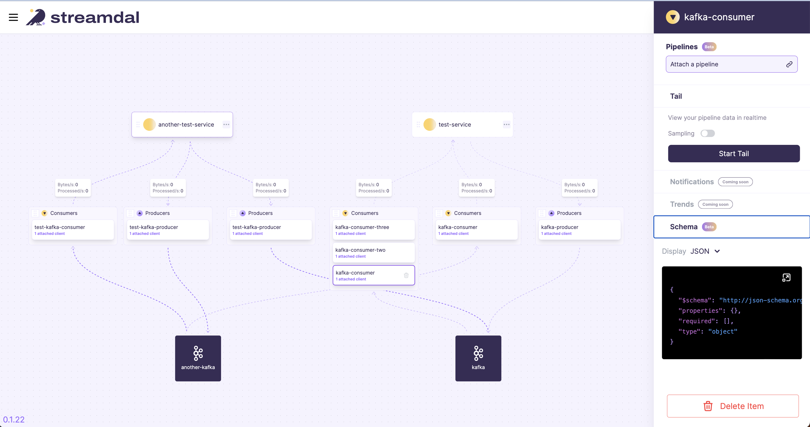

# Console

[](https://github.com/streamdal/streamdal/actions/workflows/apps-console-pr.yml)
[](https://github.com/streamdal/streamdal/actions/workflows/apps-console-release.yml)
[](https://discord.gg/streamdal)

Streamdal's console allows you visualize interact with your services, build and
attach pipelines to consumers and producers and monitor their operations.



<sub>For more details, see the main
[streamdal repo](https://github.com/streamdal/streamdal).</sub>

### Development

[](https://fresh.deno.dev)

The Console is a Deno + Fresh project that uses Preact, ReactFlow and Twind:
https://fresh.deno.dev/docs/getting-started

Make sure to install Deno: https://deno.land/manual/getting_started/installation

Optionally, copy `example.env` -> `.env` and set environment variables as
needed. By default the console will access the GRPC WEB API running on
`http://localhost:8083`

Then start the project:

```
deno task start
```

This will watch the project directory and restart as necessary.

If you make any significant Deno lib and/or configuration changes and your IDE
gets confused, you can force update the Deno lib cache with
`deno cache --reload main.ts`

**By default, the console will be viewable at: `http://localhost:8080`**

### Server

This console needs a streamdal-server to run against. See
[streamdal/server](https://github.com/streamdal/streamdal/blob/main/apps/server/README.md)
for instructions on running it locally.

### Running (non-development)

If you just want to run the console and the server together for non-development
purposes, you can use the install to bring them both up, see:
https://github.com/streamdal/streamdal#getting-started

### Dependencies

The console depends on the following dependencies (direct and indirect):

- [streamdal/server](https://github.com/streamdal/streamdal/tree/main/apps/server)
- Envoy (used by Console for gRPC-Web)
- Redis (used by `streamdal/server`)

### Releasing

We use https://deno.land/x/version@v1.1.1 to help set our release version. To
generate a release:

1. Install `version` if you don't already have it:
   `deno install -n version -r -A https://deno.land/x/version/index.ts`
2. Bump the release number: `version [major|minor|patch]`
3. git push the generated version tag: `git push origin <tag_name>`
