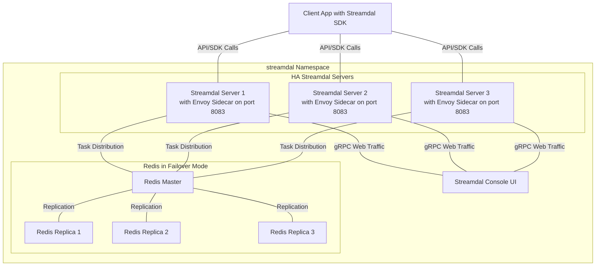

# Streamdal Helm Chart

This Helm chart deploys the Streamdal Server

## Pre-requisites

- Helm v3+
- Kubernetes cluster 1.16+


## Quisk start 

### Add repo

```bash
helm repo add streamdal https://streamdal.github.io/streamdal/helm-packages
```

### Update repos

```bash
helm repo update
```

### Install

```bash
helm install streamdal streamdal/streamdal-server

```

### View console

Forward the console port and view http://127.0.0.1:8080 in browser 

```bash 
kubectl port-forward svc/streamdal-console 8080:8080
```


## Configuration

Here are the configurable parameters of the Streamdal Server Helm chart and their default values:

### Image:
- **Repository**: `streamdal/server`
- **Pull Policy**: `IfNotPresent`
- **Tag**: `latest`

### Service:
Multiple ports configurations are available:
- **Console HTTP**: Port `8080`
- **Server gRPC**: Port `8082`
- **Server HTTP API**: Port `8081`

### Ingress:

Default ingress is disabled. However, you can enable and customize it as per your needs:

```yaml
ingress:
  enabled: false
  className: ""
  annotations: {}
  hosts:
    - host: chart-example.local
      paths:
        - path: /
          pathType: ImplementationSpecific
```

### Console Ingress:

Console ingress is also disabled by default, but can be enabled and customized:

```yaml
consoleIngress:
  enabled: false
  className: ""
  annotations: {}
  hosts:
    - host: console-example.local
      paths:
        - path: /
          pathType: ImplementationSpecific
```

### Environment Variables:

Default environment variables for configuration:

```yaml
env:
  - name: STREAMDAL_SERVER_AUTH_TOKEN
    value: "1234"
```

## Customizing Values

To override the default values, create a `values.yaml` file and then:

```bash
helm install [RELEASE_NAME] streamdal/streamdal-server-helm -f values.yaml
```

Refer to the default `values.yaml` for possible configuration options.

## Deployment Architecture 

Below is a visual representation of the deployment architecture:

- Three **Streamdal Servers** in HA, each equipped with an **Envoy Sidecar** port 8082 to handle gRPC web traffic.
- **Redis** operates in a failover mode, comprising one master and three replicas. Streamdal servers communicate with the Redis master for task distribution.
- The **Streamdal Console** illustrates how the Streamdal servers connect and serve gRPC web traffic.
- The **Client App with SDK** is an external entity, representing a typical client application that integrates with the Streamdal servers via API/SDK calls. It's important to note that this Client App is not deployed by the Helm chart but is illustrated to demonstrate potential end-user application integration.



