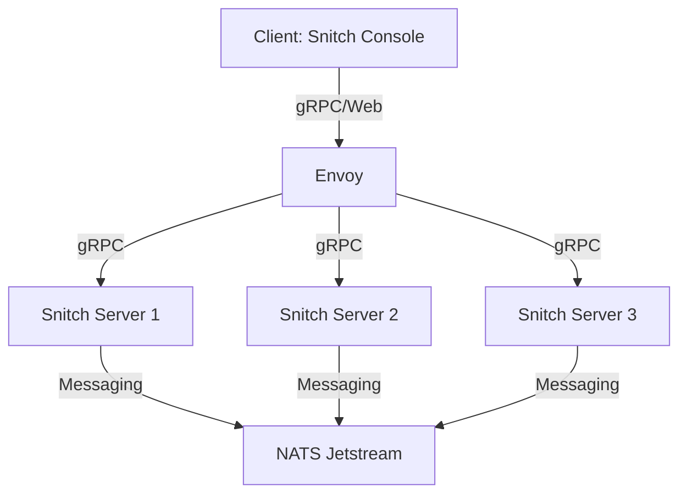

# Snitch Server Quick Start Guide

## 1. Architecture Overview

### Snitch Server

The core of our system, Snitch Server manages the primary functionalities, communicates with other components, and provides an interface for sdk's .

### NATS Jetstream

NATS is used as a messaging system. Jetstream adds persistence, ensuring that messages are stored and can be consumed even if some services are temporarily offline.

### Envoy

Envoy acts as a proxy, especially useful for gRPC communication, providing additional features such as load balancing across our Snitch Servers.

### Snitch Console

A web-based user interface that communicates with the Snitch Server through gRPC via Envoy, providing a user-friendly interface to manage and monitor the system.



## 2. Key Concepts

### Snitch Server

Snitch servers are highly available and communicate state of amoung each other. Rules and Metrics live here.

### Tokens

Tokens are used for authentication, ensuring that only valid nodes and users can access the services.

### Messaging

Through NATS Jetstream, the different components communicate by sending and receiving messages, ensuring a decoupled architecture.

## 3. How to Instantiate

### Local Development:

1. **Docker Compose:**
   Navigate to the `docker` directory and use the provided `docker-compose.yml` to start the services locally.
   ```bash
   cd docker/production/
   docker-compose up -d
   ```

2. Access the Snitch Console at `http://localhost:3000`.

### Production:

1. **Helm Deployment on Kubernetes:**
   
   First, add the Helm repository:
   ```bash
   helm repo add snitch https://streamdal.github.io/snitch/helm-charts/snitch-server
   ```
   
   Then, deploy the Helm chart:
   ```bash
   helm install snitch-server snitch/snitch-server
   ```

2. If you have set up an Ingress, you can access the Snitch Console through the provided Ingress URL. Otherwise, you can port-forward the service to your local machine:
   ```bash
   kubectl port-forward service/snitch-console 3000:3000
   ```
   And then, access the Snitch Console at `http://localhost:3000`.

## 4. How to Use

Once you've accessed the Snitch Console:

1. **Authentication:** Use the provided token (default is `1234` but should be changed in production) to authenticate.
   
2. **Dashboard:** Create rules, see metrics, and view logs.

3. **Notifications:** Set up notifications to alert you about specific events or anomalies.
